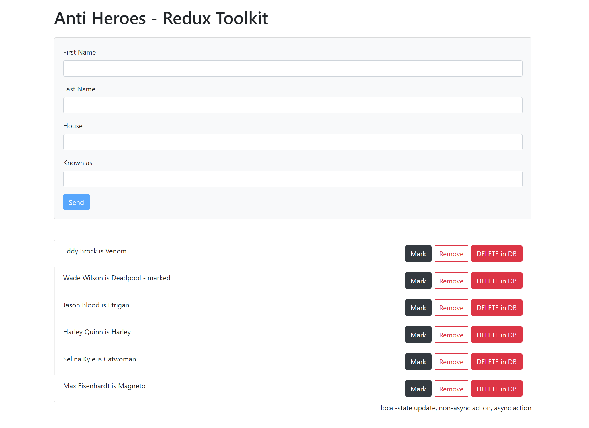

## React TypeScript Redux Toolkit

#### React-Router lazy-loading routes

#### Pre-commit hook setup

- https://dev.to/juliang/configuring-prettier-and-typescript-compiler-as-a-pre-commit-hook-44jh
  or run this

```sh
$ npx mrm lint-staged
```

### To run the project after cloning

Create or go to your demo directory then run the following in the terminal or cmd.

```sh
$ git clone https://github.com/webmasterdevlin/react-typescript-redux-toolkit.git
$ cd react-typescript-redux-toolkit
$ npm install
$ npm run start:fullstack
```

The React app and the fake web service will run concurrently.


